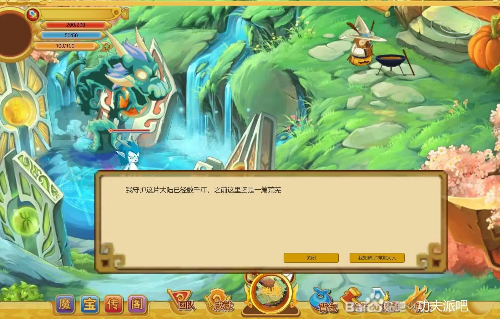
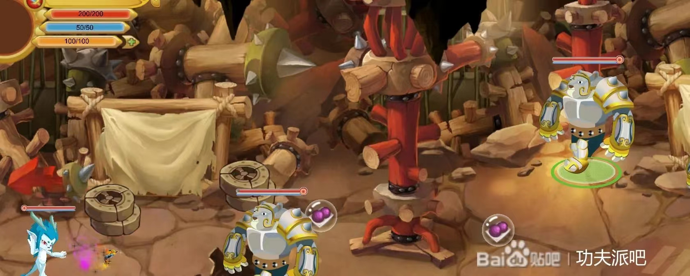
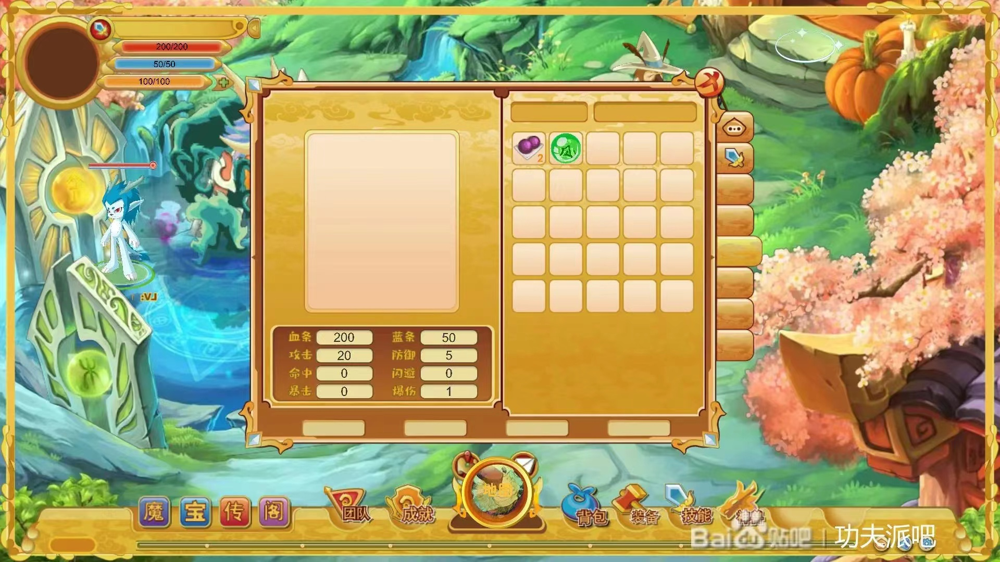

# 功夫派复刻demo

版权归属淘米公司，如有问题，欢迎留言联系删除

​		感谢您使用我们的游戏demo。我们注意到，这个demo实际上是一个单机游戏，并且目前仅支持移动、打怪、捡装备、升级和存档等基本功能。由于一些历史原因，我们已经很久没有对其进行更新和维护了。同时，这个demo实际上并没有太多的技术含量，我们深感抱歉。

​		我们希望您能够理解，这个demo在进入游戏时可能需要加载较长时间，甚至可能需要10分钟以上的时间。这是因为我们当时使用了Unity导出的WebGL格式，为了方便用户不用下载游戏，我们并没有进行预加载和优化。目前我们的主力团队也已不再使用Unity，所以我们对这个demo没有再进行过多的维护和优化。

​		我们非常感谢您对我们的支持和理解，如果您在使用这个demo的过程中遇到了任何问题，欢迎随时联系我们的客户服务团队寻求帮助。同时，我们也希望能够为您提供更好的产品和服务，如果您有任何宝贵的意见和建议，也欢迎随时与我们分享。

再次感谢您的使用，祝您游戏愉快！

## 场景预览

## 城镇

## 关卡

## 装备

## 操作

​		wasd移动 j攻击(捡装备) k跳跃，1使用物品

## 运行

### 网页版

http://gongfu.onestyle.top/ （网页版已失效）
### 本地版

* 下载代码中的build文件，解压后双击`cangmeng.exe`运行即可
* 百度网盘
  * 链接：https://pan.baidu.com/s/1p2V-zKTh4FsxBjkmU3blWw?pwd=x4kj 
    提取码：x4kj

### 退出游戏

​		由于开发进度缓慢，目前没有写退出游戏，可使用`ctrl+alt+delete`呼出任务栏窗口，直接杀后台即可

## 啰嗦两句

​		从小对武侠充满憧憬,所以从多年前开始建立了一个属于自己的"功夫派"虚拟世界。

​		我和一位朋友(ZN)合作开发了这个名为"功夫派"的项目。我主要负责游戏代码部分,朋友主要为美工设计。这个虚拟的"功夫派"中的环境和人物设计和武侠世界非常相似,我可以自由选择被分到哪个派,跟着师父学习武艺,接受任务。我沉迷其中6~7年时间。

​		这个项目现在已临时停止更新,但我仍然会购买续费来延续这个世界。项目可供预览的网址是：gongfu.onestyle.top
